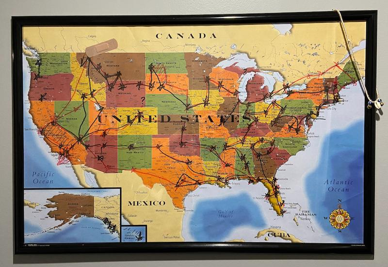
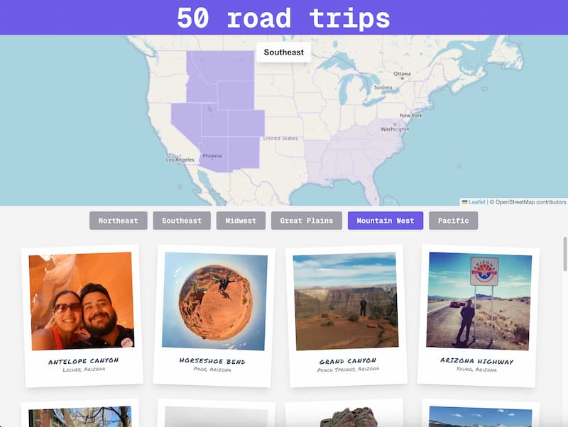

# 50 Road Trips

Photo gallery from our cross-country move along a carefully planned scenic route from the East to the West Coast, designed to include as many points of interest as possible. The original route planning map is included below.



## Demo

[https://www.50roadtrips.com/](https://www.50roadtrips.com/)



## Tech Stack

- Next.js
- OpenStreetMap
- Framer Motion

## Overview

This project is built around three main sections: the Map, the Region Selector, and the Gallery.

To keep them in sync, shared state is managed through a global provider. This allows each section to communicate with one another:

- Selecting a region on the map updates the gallery.
- Selecting a region using the selector buttons highlights that region on the map.
- Hovering over photos displays their coordinates on the map.

```js
<Provider>
  <Map />
  <RegionSelector />
  <Gallery />
</Provider>
```

## Animations

Framer Motion is used to create subtle transitions when photos appear and disappear.

```js
<AnimatePresence>
  <motion.div
    initial={{ opacity: 0 }}
    animate={{ opacity: 1 }}
    exit={{ opacity: 0 }}
  >
    <motion.div
      initial={{ scale: 0.6, opacity: 0 }}
      animate={{ scale: 1, opacity: 1 }}
      exit={{ scale: 0.6, opacity: 0 }}
      transition={{ type: "spring", stiffness: 200, damping: 20 }}
    >
      <Polaroid />
    </motion.div>
  </motion.div>
</AnimatePresence>
```

## ENV

```bash
NEXT_PUBLIC_CONTENTFUL_API_URL=
```

## Run

```bash
npm install
npm run dev
```

## Author

Jorge Donoso

## License

MIT
